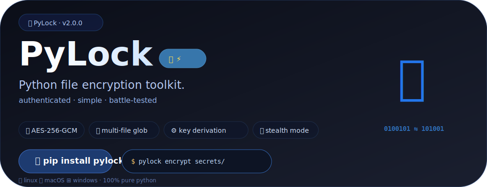

[](https://pypi.org/project/pylock-suite/)
[](https://www.gnu.org/licenses/gpl-3.0)
[](https://www.python.org/)
[](https://github.com/psf/black)
[](https://github.com/skye-cyber/pylock/actions)
[](https://pypi.org/project/pylock-suite/)


# 🔐 PyLock

**Modern, Beautiful, Secure File Encryption**

*Encrypt and decrypt files with style. Built with Click and Rich for a delightful CLI experience.*

- [Features](#features) 
- [Installation](#installation) 
- [Usage](#usage) 
- [Ciphers](#available-ciphers) 
- [Documentation](https://github.com/skye-cyber/pylock/wiki)
---

---

## ✨ Features

- 🎨 **Beautiful Interface** — Rich terminal output with progress bars, tables, and colors
- 🔒 **Modern Cryptography** — AES-256-GCM, ChaCha20-Poly1305, Fernet (RSA and Hybrid under development)
- 📁 **File & Folder Support** — Encrypt individual files or entire directories
- 🗝️ **Smart Key Management** — Automatic key generation with secure storage
- 🔍 **Metadata Preservation** — Store encryption info for seamless decryption
- 🛡️ **Process Locking** — Prevent concurrent operations from corrupting data
- 📂 **Binary File Support** — Handle text and binary files (images, PDFs, videos)
- ⚡ **High Performance** — Efficient encryption/decryption for large files

---

## 🚀 Installation

### From PyPI (Recommended)

```bash
pip install pylock-suite
```

### From Source

```bash
git clone https://github.com/skye-cyber/pylock.git
cd pylock
pip install -e .
```

### Development Install

```bash
pip install -e ".[dev]"
```

### Requirements

- Python 3.8+
- cryptography library
- click and rich for CLI
- base64 for binary data handling

---

## 🎯 Quick Start

### Encrypt a File

```bash
# Interactive mode (prompts for password)
pylock encrypt secret.txt

# With explicit options
pylock encrypt document.pdf --cipher aes-256-gcm --password "mypassword"

# Short alias
pl encrypt photo.jpg -c chacha20
```

### Decrypt a File

```bash
# Interactive mode
pylock decrypt secret.txt.locked

# With key file
pylock decrypt backup.zip.locked --key-file key.pem

# Specify output
pylock decrypt data.enc -o decrypted.data
```

### Interactive Mode

```bash
pylock interactive
```

---

## 📖 Usage

### Global Options

| Option | Description |
|--------|-------------|
| `-v, --verbose` | Enable verbose output |
| `-q, --quiet` | Suppress non-error output |
| `--version` | Show version and exit |

### Commands

#### `encrypt`
Encrypt files or folders.

```bash
pylock encrypt [OPTIONS] PATH

Options:
  -c, --cipher TEXT       Cipher to use (default: aes-256-gcm)
  -p, --password TEXT     Encryption password
  -k, --key-file PATH     Save key to file
  -o, --output PATH       Output file/directory
  --no-compress           Disable compression
```

#### `decrypt`
Decrypt files or folders.

```bash
pylock decrypt [OPTIONS] PATH

Options:
  -p, --password TEXT     Decryption password
  -k, --key-file PATH     Read key from file
  -o, --output PATH       Output file/directory
  --brute-force           Attempt brute force (requires --wordlist)
  -w, --wordlist PATH     Wordlist for brute force
```

#### `list-ciphers`
Display available ciphers and their properties.

```bash
pylock list-ciphers
```

#### `generate-key`
Generate encryption keys (especially for RSA).

```bash
pylock generate-key --cipher rsa -o mykey.pem
```

#### `verify`
Check if a file is encrypted and display metadata.

```bash
pylock verify mystery.file
```

#### `interactive`
Launch guided interactive mode.

```bash
pylock interactive
```

---

## 🔐 Available Ciphers

| Cipher | Security | Type | Best For | Status |
|--------|----------|------|----------|--------|
| `aes-256-gcm` | 🔒 Modern (Recommended) | Symmetric | General purpose, hardware accelerated | ✅ Working |
| `chacha20-poly1305` | 🔒 Modern | Symmetric | Mobile/ARM devices, software-only | ✅ Working |
| `fernet` | 🔒 Modern | Symmetric | Simple password-based encryption | ✅ Working |
| `rsa-oaep` | 🔒 Modern | Asymmetric | Key exchange, small data (<190 bytes) | ⚠️ Needs Fix |
| `hybrid-rsa-aes` | 🔒 Modern | Hybrid | Large files with asymmetric keys | ⚠️ Needs Fix |
| `caesar` | ⚠️ Classical | Substitution | Educational only | ❌ Deprecated |
| `vigenere` | ⚠️ Classical | Polyalphabetic | Educational only | ❌ Deprecated |
| `playfair` | ⚠️ Classical | Digraph | Educational only | ❌ Deprecated |
| `morse` | ⚠️ Encoding | Encoding | Text encoding, educational | ❌ Deprecated |

> ⚠️ **Warning:** Classical ciphers are deprecated and will be replaced with modern alternatives in future versions.

> 🔧 **Note:** RSA and Hybrid-RSA-AES ciphers are currently under development and may not work correctly in this version.

---

## 💡 Examples

### Encrypt with Different Ciphers

```bash
# AES-256-GCM (default)
pylock encrypt secrets.txt

# ChaCha20-Poly1305 (better for mobile)
pylock encrypt mobile-data.zip -c chacha20

# Fernet (simple password-based)
pylock encrypt document.pdf -c fernet

# RSA and Hybrid-RSA-AES are currently under development
# pylock encrypt api-key.txt -c rsa-oaep
# pylock encrypt database.sql -c hybrid-rsa-aes
```

### Batch Encryption

```bash
# Encrypt entire folder
pylock encrypt ~/Documents/Private --cipher aes-256-gcm -o private.enc

# Decrypt folder
pylock decrypt private.enc -o ~/Documents/Private
```

### Key Management

```bash
# Generate and save key
pylock generate-key -c aes-256-gcm -o master.key

# Encrypt with saved key
pylock encrypt file.txt --key-file master.key

# Decrypt with same key
pylock decrypt file.txt.locked --key-file master.key
```

### Brute Force (Recovery)

```bash
# Attempt password recovery
pylock decrypt unknown.locked --brute-force --wordlist passwords.txt
```

---

## 🏗️ Architecture

```
PyLock/
├── pylock/
│   ├── cli/               # Click + Rich CLI interface
│   │   ├── cli.py          # Main CLI entry point
│   │   └── utils.py        # CLI utilities
│   ├── core/
│   │   ├── pylock.py       # Core encryption engine
│   │   ├── pylockmanager.py # File/directory processing
│   │   ├── lock.py         # Process lock manager
│   │   ├── interfaces.py   # Interface definitions
│   │   ├── exceptions.py   # Custom exceptions
│   │   └── key_manager.py  # Key derivation
│   ├── ciphers/
│   │   ├── aes256gsm.py    # AES-256-GCM (✅ Working)
│   │   ├── chacha20.py     # ChaCha20-Poly1305 (✅ Working)
│   │   ├── fernet.py       # Fernet (✅ Working)
│   │   ├── rsa.py          # RSA-OAEP (⚠️ Needs Fix)
│   │   ├── hybridrsa_aes.py # Hybrid encryption (⚠️ Needs Fix)
│   │   ├── classical.py    # Classical ciphers (❌ Deprecated)
│   │   └── factory.py      # Cipher factory
│   └── utils/
│       ├── logging.py      # Rich logging
│       └── file_utils.py   # File operations
```

---

## ⚠️ Security Notice

**PyLock is designed for legitimate data protection. Please use responsibly:**

- 🔑 **Keep passwords safe** — Lost passwords cannot be recovered (unless brute force succeeds)
- 🗝️ **Backup encryption keys** — Store key files in secure, separate locations
- 🧪 **Test decryption** — Always verify you can decrypt before deleting originals
- 📋 **Use strong passwords** — Combine uppercase, lowercase, numbers, and symbols
- 🏛️ **Compliance** — Ensure your use complies with local laws and regulations

> **Warning:** Irresponsible use can result in permanent data loss. The authors are not responsible for lost data due to forgotten passwords or corrupted key files.

---

## 🤝 Contributing

Contributions are welcome! Please see our [Contributing Guide](CONTRIBUTING.md) for details.

```bash
# Fork and clone
git clone https://github.com/your-username/pylock.git

# Create virtual environment
python -m venv venv
source venv/bin/activate  # Windows: venv\Scripts\activate

# Install dev dependencies
pip install -e ".[dev]"

# Run tests
pytest

# Format code
black src tests
isort src tests

# Type check
mypy src/pylock
```

## 📜 License

This project is licensed under the **GNU General Public License v3.0** — see the [LICENSE](LICENSE) file for details.

## 🙏 Acknowledgements

- [Click](https://click.palletsprojects.com/) — Command line interface framework
- [Rich](https://rich.readthedocs.io/) — Beautiful terminal formatting
- [Cryptography](https://cryptography.io/) — Modern cryptographic recipes
- [PyCryptodome](https://www.pycryptodome.org/) — Low-level cryptographic primitives
- [Shields.io](https://shields.io/) — Status badges

---

<div align="center">

Made with ❤️ by **Wambua (Skye-Cyber)**

⭐ Star us on GitHub — it motivates us to keep improving!

</div>
